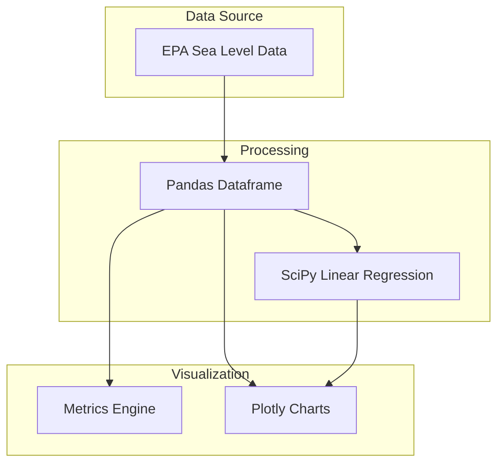

# Sea Level Intelligence

[](https://elliottfairhall-sea-level-prediction-main-f0riix.streamlit.app/)
[](https://www.python.org/downloads/)
[](https://opensource.org/licenses/MIT)
[](https://github.com/astral-sh/ruff)

A climate data analytics dashboard that visualizes historical ocean trends and projects future sea level rise using
statistical regression models. This tool transforms raw environmental data into actionable climate intelligence.


## Features

- **Longitudinal Analysis**: Visualization of Global Average Absolute Sea Level Change from 1880 to present
- **Predictive Modeling**: Linear regression forecasting extending to 2050 and beyond
- **Dynamic Filtering**: Interactive time-series controls to isolate specific historical periods
- **Key Metrics Dashboard**: Real-time calculation of average annual rise and latest recorded levels

## Architecture



## Project Structure

```
Sea-Level-Prediction/
├── app.py                  # Main dashboard application
├── assets/
│   ├── data/               # Historical datasets
│   └── images/             # Static assets
├── styles/                 # Custom CSS styling
├── pyproject.toml          # Project configuration
├── requirements.txt        # Dependencies
└── README.md
```

## Requirements

- Python 3.10 or higher
- Streamlit >= 1.32.0
- Pandas >= 2.0.0
- Plotly >= 5.18.0
- SciPy >= 1.11.0

## Installation

1. Clone the repository:

   ```bash
   git clone https://github.com/elliottfairhall/Sea-Level-Prediction.git
   cd Sea-Level-Prediction
   ```

2. Create a virtual environment:

   ```bash
   python -m venv venv
   source venv/bin/activate  # On Windows: venv\Scripts\activate
   ```

3. Install dependencies:

   ```bash
   pip install -r requirements.txt
   ```

## Usage

1. Start the dashboard:

   ```bash
   streamlit run app.py
   ```

2. Open your browser at `http://localhost:8501`. The application launches on the **Project Overview** tab.

3. Use the **Data Engine** sidebar to adjust:

   - **Start Year**: Filter historical data range
   - **Forecast Year**: Extend the prediction horizon

## Business Use Case

This project demonstrates capabilities essential for environmental and risk analytics:

- **Trend Forecasting**: Applying statistical models to time-series data to predict future states.
- **Risk Assessment**: Visualizing critical environmental thresholds for infrastructure planning.
- **Data Storytelling**: Communicating complex scientific data through intuitive, interactive dashboards.

## License

This project is licensed under the MIT License - see the [LICENSE](LICENSE) file for details.

## Author

**Elliott Fairhall**

- Website: [data-flakes.dev](https://data-flakes.dev)
- GitHub: [@elliottfairhall](https://github.com/elliottfairhall)
- LinkedIn: [Elliott Fairhall](https://uk.linkedin.com/in/elliott-fairhall-666945105)
